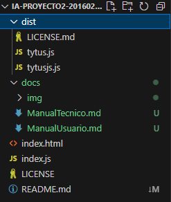

# Manual Técnico

## Explicando el directorio del proyecto



En el directorio `dist/`, se encuentra la librería de machine learning.

En el directorio `docs/`, se encuentra la documentación del proyecto: el manual de usuario y este documento.

El archivo `index.html` contiene el único punto de entrada del proyecto.

El archivo `index.js` contiene toda la lógica del proyecto y debe usarse dentro de `index.html`.

El archivo `LICENSE` contiene la licencia del proyecto (MIT).

El archivo `README` contiene el título del proyecto y un enlace hacia el deployment en github pages.


## index.html

### Descripción General

En este archivo se implementa la interfaz, este archivo contiene funcionalidad que permite al usuario cargar archivos CSV, seleccionar algoritmos y entrenar modelos de regresión lineal, regresión polinómica, árboles de decisión, Naive Bayes, redes neuronales y K-means.

El body contiene los siguientes componentes principales:

### Head
Esta sección tiene la importación de librerías y metadatos del proyecto.

```html
<head>
    <meta charset="UTF-8">
    <meta name="viewport" content="width=device-width, initial-scale=1.0">
    <title>IA - Proyecto 2 - 201602988</title>
    <script src="https://cdn.tailwindcss.com"></script>
    <script type="text/javascript" src="https://unpkg.com/vis-network@9.1.9/standalone/umd/vis-network.min.js"></script>
    <script src="https://www.gstatic.com/charts/loader.js"></script>
    <script>
        let googleChartsReady = false;

        google.charts.load('current', {packages: ['corechart']});
        google.charts.setOnLoadCallback(onGoogleChartsLoad);

        function onGoogleChartsLoad() {
            googleChartsReady = true;
        }

        function isGoogleChartsReady() {
            return googleChartsReady;
        }
    </script>
</head>
```

### Selección archivo de entrada
- `<input class="border-2" type="file" id="filechooser" />`
  - Sirve para seleccionar un archivo del sistema de archivos del sistema
- `<input class="h-6 w-6" type="checkbox" id="ignorarHeaderCSV" checked />`
  - Utilizado para ignorar la primera línea del archivo de entrada

### Selección de algoritmo
- `<select class="border-2" id="algoritmo"></select>`
  - Sirve como elemento al que se le van a apendar el listado de algoritmos disponibles

### Sección de Resultados
- Se tienen tres contenedores para mostrar resultados generados por los algoritmos.
  - `resultadosCanvas`
  - `resultadosGeneral`
  - `resultadosGoogle`

### Dependencias

El archivo depende de varios recursos externos:

- **Tailwind CSS**: Para el diseño visual.
- **Vis.js**: Para visualización de redes.
- **Google Charts**: Para visualización gráfica de resultados.
- **Tytus.js**: librería de machine learning.


## index.js

### Declaración de Variables de Elementos HTML

Las variables para los siguientes elementos del HTML se declaran al inicio del código y se asignan en la función window.onload::

- `Inputs`: element_filechooser, element_ignorarHeaderCSV, element_rangoXLinearRegression, element_gradosPolynomialRegression, etc.
- `Botones`: element_entrenarLinearRegression, element_predecirLinearRegression, element_entrenarPolynomialRegression, element_predecirPolynomialRegression, element_clasificarKMeans.
- `Secciones de algoritmos`: element_seccionLinearRegression, element_seccionPolynomialRegression, element_seccionDecisionTree, element_seccionNaiveBayes, element_seccionNeuralNetwork, element_seccionKMeans, element_seccionKNearestNeighbor.
- `Visualización de resultados`: element_resultadosGeneral, element_resultadosGoogle, element_resultadosCanvas.

### Funciones Comunes
Son funciones que se utilizan en todos los algoritmos implementados, y que se utilizan en repetidas ocasiones.

#### Procesamiento de Datos CSV
- `openCSV`: Abre un archivo CSV del sistema de archivos y lo carga en el navegador. Muestra un mensaje de error si no se selecciona un archivo.
- `readCSV`: Lee el contenido del archivo CSV y lo convierte en una matriz 2D, opcionalmente, verifica que solo contenga datos numéricos.

#### Generación de Tablas HTML
- `Array2DToHTMLTable`: Convierte una matriz 2D a una tabla HTML. La primera fila se interpreta como encabezado.

#### Verificación de Tipos
- `isNumber`: Verifica si un valor es numérico, soportando tanto strings numéricos como valores de tipo número.


### Algoritmos
La implementación de algunos algoritmos de aprendizaje automático, se encuentra en las siguientes funciones.

#### Regresión Lineal
- `showLinearRegression` y `hideLinearRegression`: Muestran y ocultan la sección de opciones de la regresión lineal.
- `LinearRegression_EjecutarEntrenamiento`: Entrena un modelo de regresión lineal usando el archivo CSV cargado.
- `LinearRegression_EjecutarPrediccion`: Realiza predicciones y visualiza los resultados usando Google Charts.

#### Regresión Polinomial
- `showPolynomialRegression` y `hidePolynomialRegression`: Muestran y ocultan la sección de opciones de la regresión polinomial.
- `PolynomialRegression_EjecutarEntrenamiento`: Entrena un modelo de regresión polinomial de varios grados.
- `PolynomialRegression_EjecutarPrediccion`: Realiza predicciones y visualiza los resultados con Google Charts.

#### K-Means
- `showKMeans` y `hideKMeans`: Muestran y ocultan la sección de K-Means.
- `KMeans_Clasificar`: Clasifica los datos en K clusters y visualiza los resultados en un canvas.

#### Otros algoritmos

Existen otros algoritmos en el código, pero que aún no han sido implementados, `Decision Tree`, `Naive Bayes`, `Neural Networks` y `K-Nearest Neighbor`

### window.onload

En esta función se realizan los queries de componentes, rellenado de comboboxes con los algoritmos disponibles y binding de eventos de todos los botones
