# Manual de Usuario

## Inicio de la aplicación

Este proyecto tiene como objetivo demostrar algunos de los algoritmos que se utilizan en los modelos de inteligencia artificial, y se tiene un enfoque en la simplicidad.

Para utilizar la aplicación, basta con abrir el archivo index.html en cualquier navegador, o alternativamente utilizar el link de github pages: [https://zantetsukengt.github.io/IA-Proyecto2-201602988/](https://zantetsukengt.github.io/IA-Proyecto2-201602988/)

La pantalla de inicio se ve de la siguiente forma:

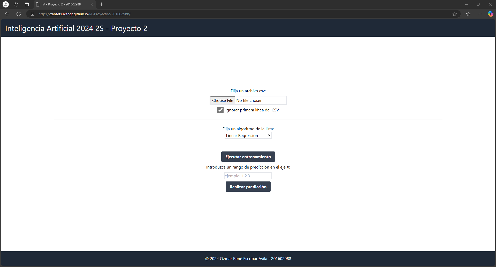

## Selección de un archivo de entrada CSV

Para empezar, todos los algoritmos tienen en común la selección de archivos de entrada, y el único formato de archivo soportado es el CSV

Opcionalmente, se puede configurar si se desea ignorar la primera linea del archivo, que normalmente corresponde con los encabezados de las columnas.

El contenido sugerido de los archivos para los algoritmos actualmente implementados es el siguiente:

```csv
x,y
1,2
3,4
5,6
7,8.8
8,9

```

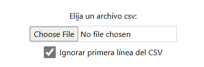

## Selección de algoritmo

En esta sección se puede seleccionar un algoritmo en el que se tenga interés, la página ajustará el contenido respectivamente con las opciones para cada algoritmo:

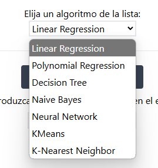

Linear Regression:

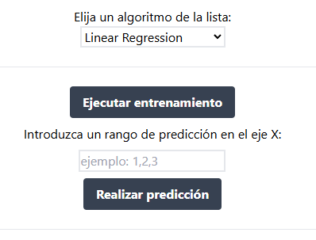

Polynomial Regression:

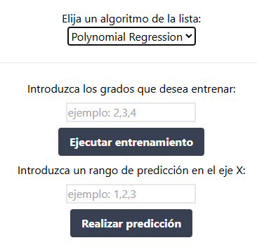

## Sección de opciones - Linear Regression

Este algoritmo sirve para realizar predicciones simples, a lo largo de una línea recta en el plano cartesiano.

Para ejecutarlo, primero hay que elegir un archivo de entrada y dar click en el botón de entrenamiento:

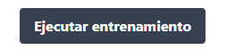

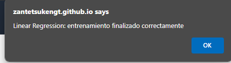

Luego, tendremos que realizar alguna predicción en una serie de puntos en el eje X:

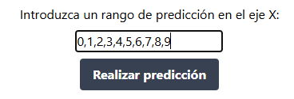

Una vez haga click en el botón de predecir, se generará una serie de resultados y gráficos:

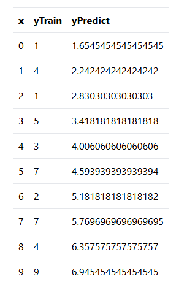

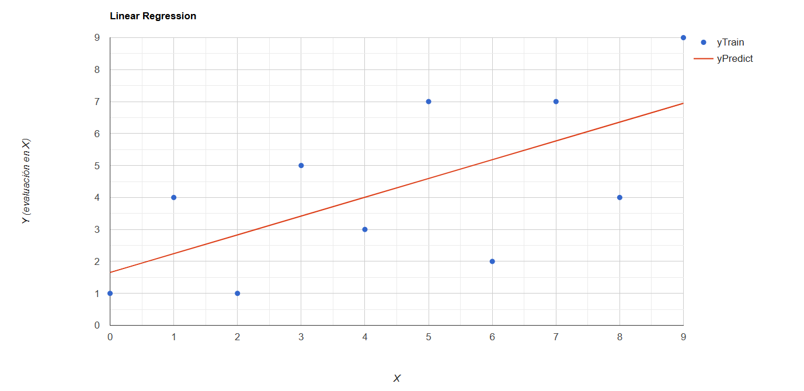

Si desea hacer cambios, debe cargar otro archivo de entrada, y volver a entrenar el modelo.

## Sección de opciones - Polynomial Regression

Este algoritmo sirve para realizar análisis de tendencias, a lo largo de una curva de cualquier grado en el plano cartesiano.

Para ejecutarlo, primero hay que elegir un archivo de entrada, especificar una serie de grados en los que se desea entrenar el modelo, y dar click en el botón de entrenamiento:

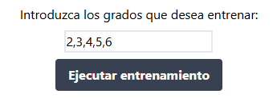

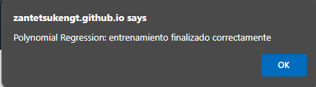

Luego, tendremos que realizar alguna predicción en una serie de puntos en el eje X:

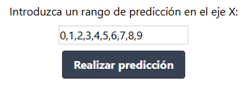

Una vez haga click en el botón de predecir, se generará una serie de resultados y gráficos:

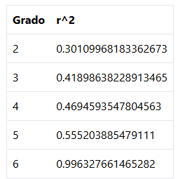

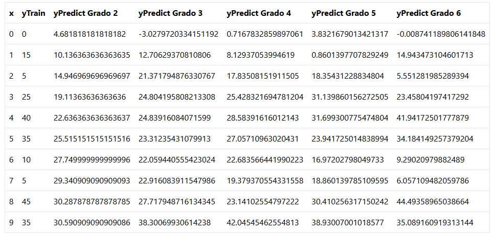

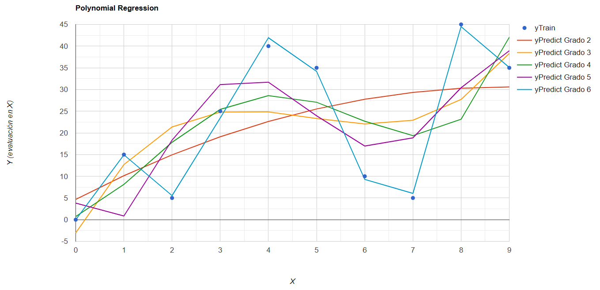

Si desea hacer cambios, debe cargar otro archivo de entrada, y volver a entrenar el modelo.

## Sección de opciones - KMeans

Este algoritmo sirve para identificar patrones, dado un conjunto de puntos(x,y) en el plano cartesiano, se pueden realizar `k` clasificaciones, y el resultado es el centroide aproximado de cada clasificación.

Para ejecutarlo, debe especificar la cantidad de clases en las que desea clusterizar los datos, y luego darle en el botón de Ejecutar clasificación:

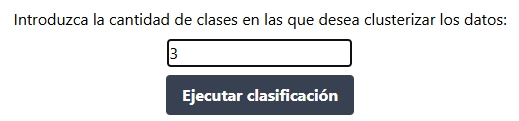

Una vez ejecutada la clasificación, se generará una serie de resultados y gráficos:

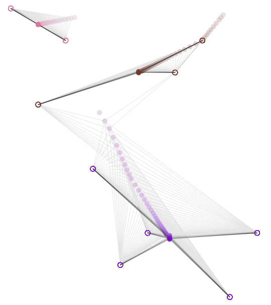

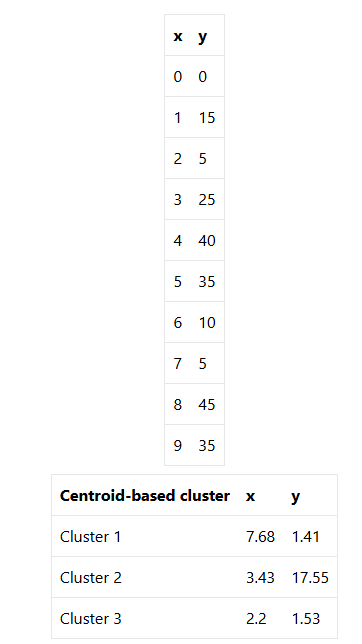
